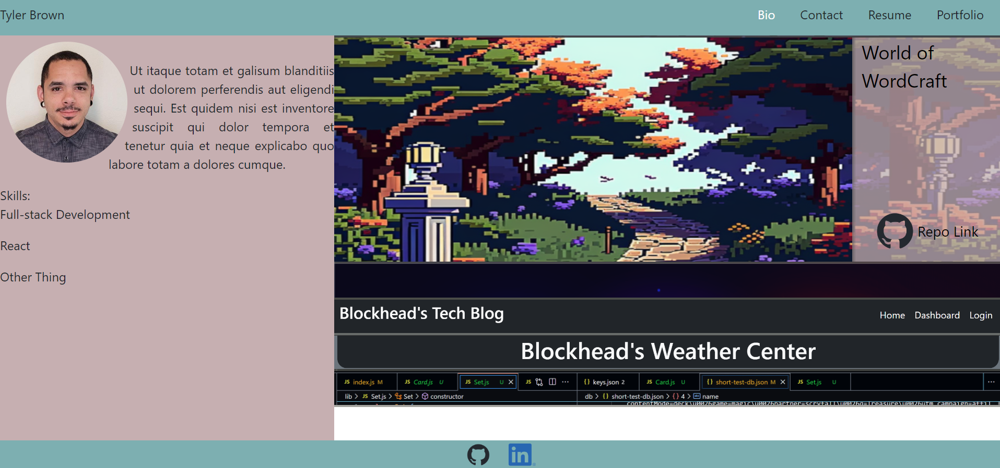

# Tyler's WebDev Portfolio

## Table of Contents
   * [Description](#Description)
   * [Usage](#Usage)
   * [Questions](#Questions)
   * [Deployed](#Deployed)

## Description

This app is designed to work on desktop or mobile (mobile links not responding correctly at this time), and its primary purpose is to help me find my first WebDev J.O.B.

## Usage

Use this [App](https://onedeadfox.github.io/tylers-professional-portfolio/) to hire me, Thanks!

## Questions

If you have any questions or comments regarding my application please contact me:

  Github: [OneDeadFox](https://github.com/OneDeadFox)

  Email: tjosephb.pro@gmail.com

  ## Deployed Link

  https://onedeadfox.github.io/tylers-professional-portfolio/